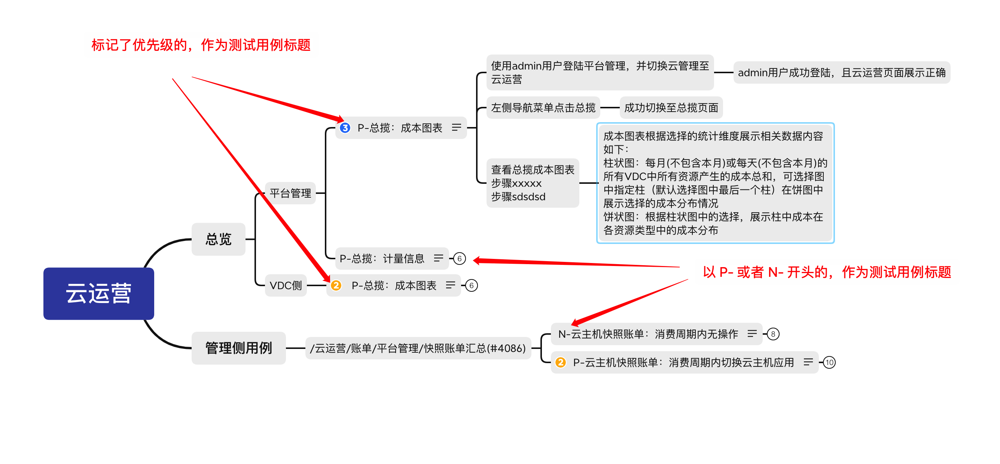
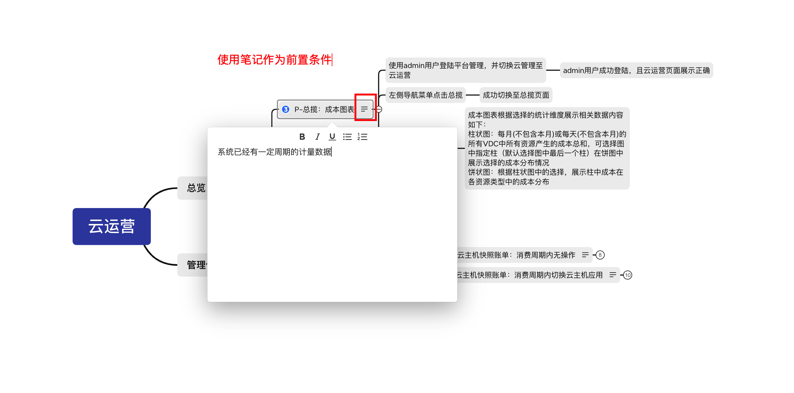
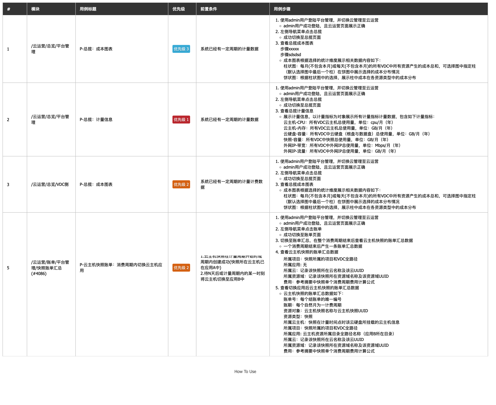
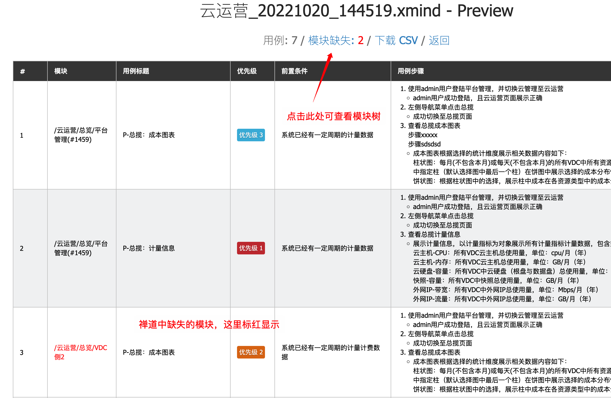
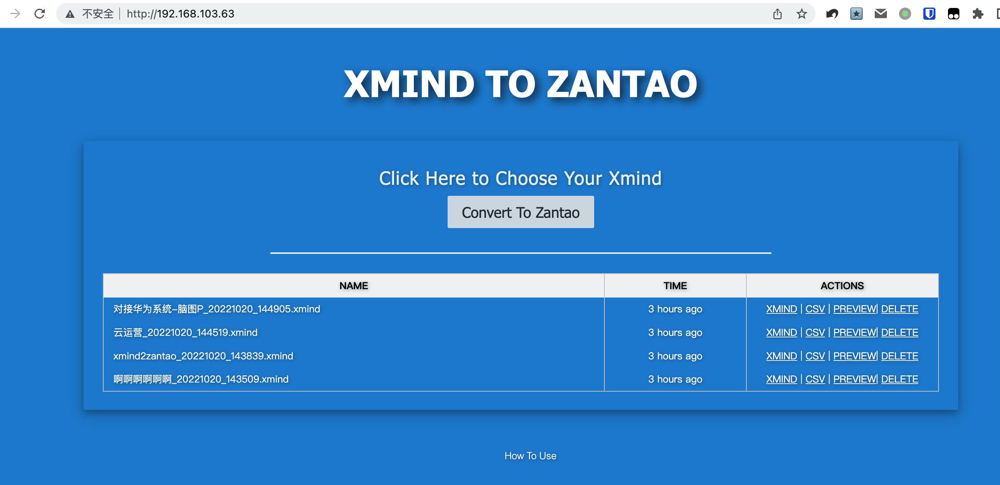
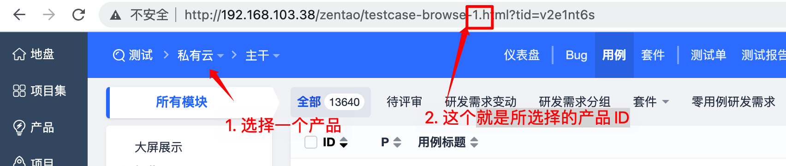

## Xmind2Zantao Guide

### 规则
**测试用例定义:**



**前置条件:**



**输出概览:**



### 详细说明

1. 优先级标记的节点，或者以`P-`和`N-`开头的节点，作为测试用例的标题，即测试用例开始。
2. 用例标题后的节点为用例步骤，用例步骤后面的节点为预期结果。
3. 用例标题之前的节点，拼接组成`模块`属性。
   1. 模块以`/`开始
   2. 如果标题之前的节点中定义了禅道中的真实模块（以模块ID结尾：`/云运营/账单/平台管理/快照账单汇总(#4086)`），则直接使用。
4. 使用`笔记(note)`作为前置条件。
5. 以`叹号(!)`开头的节点将被忽略。
6. 自由主题会被忽略，不进行转换


**下载示例Xmind文件:**

- [xmind2zantao.xmind](web/static/guide/xmind2zantao.xmind)

### 附加功能（需要后台启用相关配置）

预览中查看每个用例的模块在禅道是否存在。



点击进入模块的树状展示页面，不存在的模块标红展示。


### 部署

1. 快速启动web服务

```shell
# clone this git repo ahead
[root@xmind2zantao web]# cd /path/to/xmind2zantao/web
[root@xmind2zantao web]# pip install -r requirements.txt
[root@xmind2zantao web]# sh deploy.sh
start deploy...
finish deploy...
* Running on http://0.0.0.0:8000/
[root@xmind2zantao web]# 
```
打开浏览器 输入正确的IP地址和端口来使用。




2. 启用禅道模块检查功能

目前只支持对一个产品的目录进行检查，如果有多个产品都是用，可以部署多个web服务来暂时解决。

* 获取产品ID



* 修改appliction.py文件中的配置，配置正确的禅道地址、认证信息以及上面获取到的产品ID

```python
# 是否启用禅道附加功能，目前主要是对模块的检查
ENABLE_ZANTAO_API = False
# 禅道地址
ZANTAO_BASE_URL = 'http://192.168.103.38/zentao'
# 登录信息
ZANTAO_USERNAME = 'xxx'
ZANTAO_PASSWD = 'xxx'
# 产品ID。多云管理：3，私有云：1
ZANTAO_PRODUCT_ID = 3
```

* 重启web服务

### 感谢

   参考：xmind2testlin xmindparser