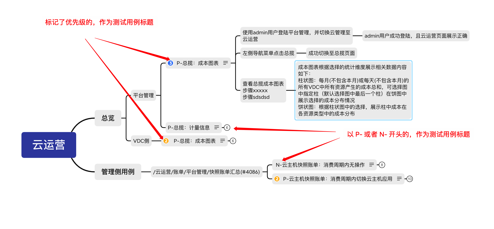
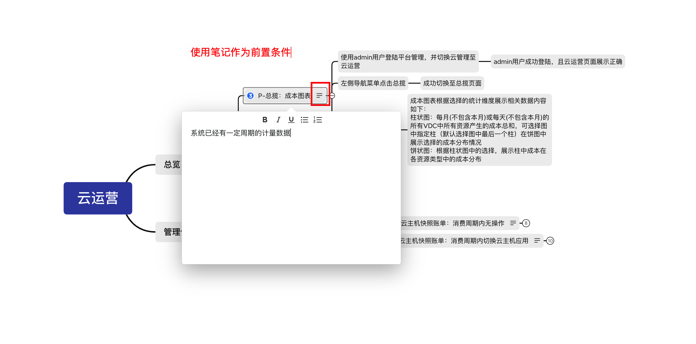
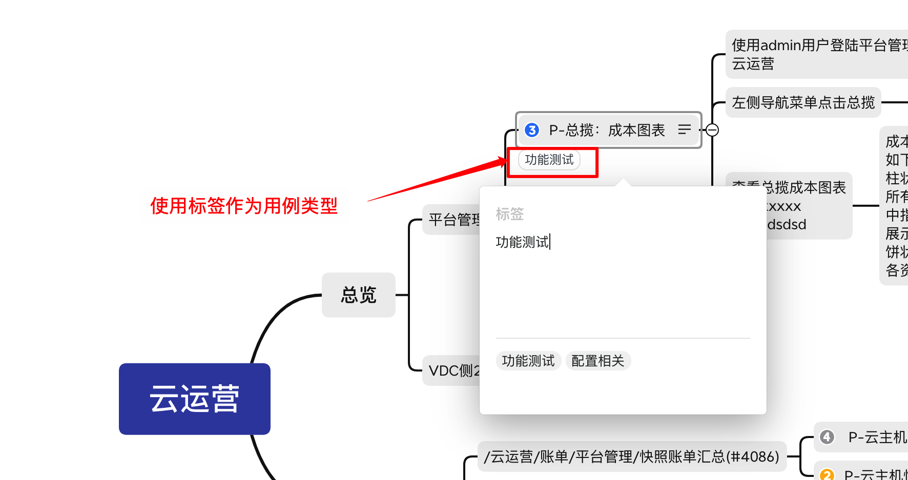
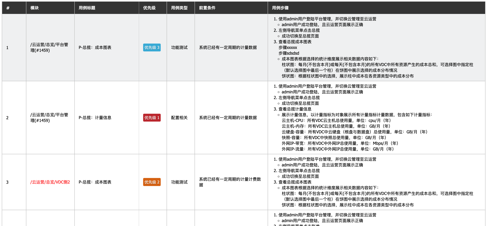
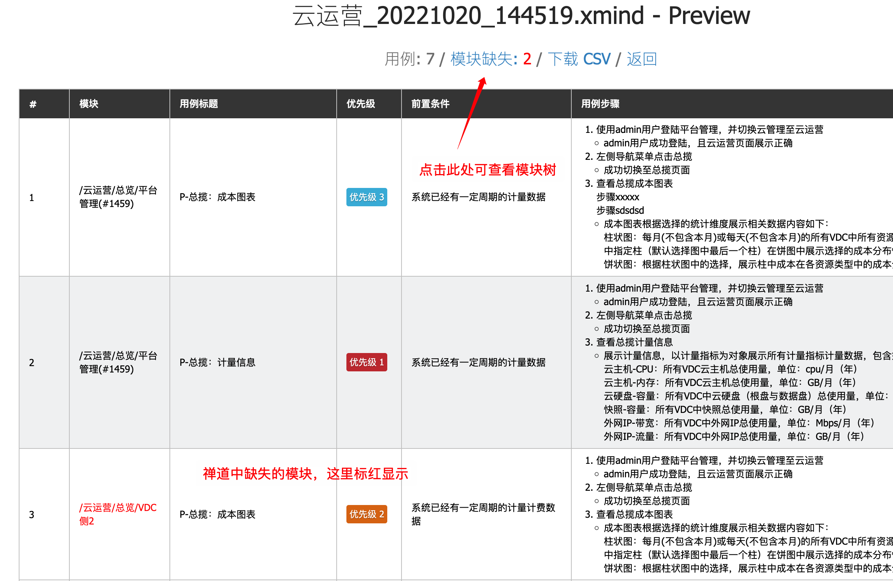
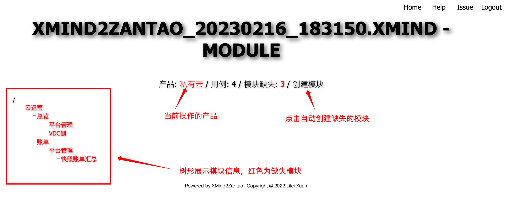

## Xmind2Zantao Guide

### 规则
**测试用例定义:**

**前置条件:**

**用例类型:**

**输出概览:**

### 详细说明

1. 优先级标记的节点，或者以`P-`和`N-`开头的节点，作为测试用例的标题，即测试用例开始。
2. 用例标题后的节点为用例步骤，用例步骤后面的节点为预期结果。
3. 用例标题之前的节点，拼接组成`模块`属性。
   1. 模块以`/`开始
   2. 如果标题之前的节点中定义了禅道中的真实模块（以模块ID结尾：`/云运营/账单/平台管理/快照账单汇总(#4086)`），则直接使用。
4. 使用`笔记(note)`作为前置条件。
5. 使用`标签(label)`作为用例类型，只有第一个标签生效。
6. 以`叹号(!)`开头的节点将被忽略。
7. 自由主题会被忽略，不进行转换

**下载示例Xmind文件:**

- [xmind2zantao.xmind](xmind2zantao.xmind)

### 附加功能（需要后台启用相关配置）

预览中查看每个用例的模块在禅道是否存在。

点击进入模块的树状展示页面，不存在的模块标红展示。

